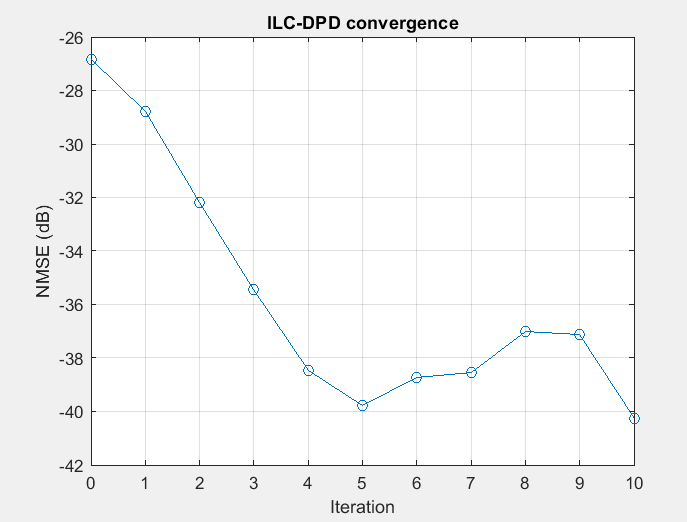
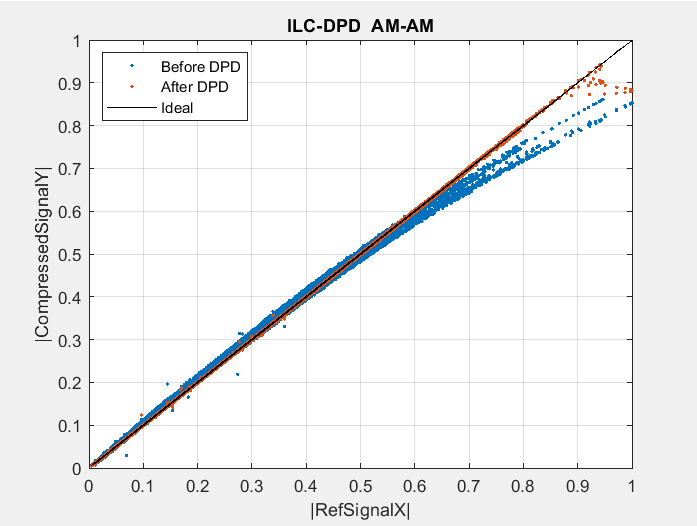
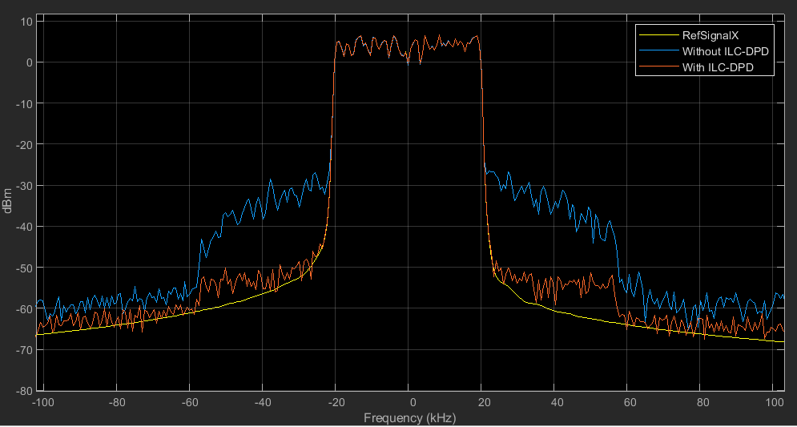
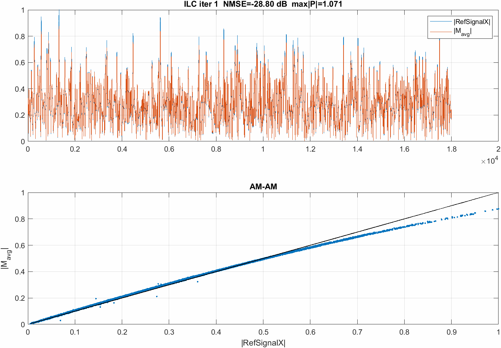

# ILC-DPD on ADALM-Pluto SDR

Model-free **Iterative Learning Control Digital Predistortion (ILC-DPD)** with a
real **ADALM-Pluto** SDR in a hardware-in-loop TX→RX loopback. The predistorted
waveform is learned sample-by-sample directly from measurements — no PA model,
no basis functions, no coefficient fitting.

## How it works

Start with the predistorter input equal to the reference, `P_0 = x`. Each
iteration:

1. **Capture** — transmit `P` on the Pluto, receive the loopback, and run
   `captureAndSync`: integer alignment via cross-correlation, fractional
   alignment via a cubic-Lagrange Farrow resampler, then DC removal and
   RMS + phase normalization to the reference.
2. **Average** — repeat the capture `N_avg` times and average (I/Q averaging)
   to suppress measurement noise.
3. **Update** — multiplicative complex-ratio learning law:

   ```
   P_{k+1} = P_k .* ( (1 - mu) + mu * T ./ M_avg )
   ```

   where `T = G_target * x` is the desired linear output and `M_avg` is the
   averaged measured output.

The error to the ideal linear response (NMSE) is logged each iteration, and a
per-iteration figure (`ilc_iter_kk.png`) is saved.

## Requirements

- MATLAB with **Communications Toolbox** (`sdrrx` / `sdrtx` for Pluto) and
  **DSP System Toolbox** (`dsp.SpectrumAnalyzer`).
- An **ADALM-Pluto** SDR with a **TX↔RX loopback** (coax cable + suitable
  attenuator; do not exceed the RX input rating).
- `RefSignal.mat` — the reference waveform (included; self-generated).

## Run

```matlab
>> ILC_DPD_PlutoSDR
```

Key parameters at the top of `ILC_DPD_PlutoSDR.m`:

| Param | Meaning | Default |
|------|---------|---------|
| `CenterFrequency` | RF center frequency (MHz) | 2000 |
| `BasebandSampleRate` | Baseband sample rate (MHz) | 1 |
| `TxGain` / `RxGain` | Pluto TX / RX gain (dB) | -3 / 0 |
| `mu` | ILC learning rate | 0.5 |
| `N_avg` | I/Q averaged captures per iteration | 16 |
| `n_iter` | ILC iterations | 10 |

## Results

Convergence (NMSE vs iteration):



AM-AM, before vs after ILC-DPD:



Output spectrum:



Per-iteration learning (animation):



## Repository contents

| File | Description |
|------|-------------|
| `ILC_DPD_PlutoSDR.m` | Main script (ILC loop + `captureAndSync` + Farrow resampler) |
| `RefSignal.mat` | Reference waveform |
| `images/ILC_DPD_Convergence.PNG` | NMSE convergence plot |
| `images/ILC_DPD_AMAM.PNG` | AM-AM before/after |
| `images/Spectrum.PNG` | Output spectrum |
| `images/ilc_convergence.gif` | Animation of the per-iteration learning |
| `LICENSE` | MIT license |

## Algorithm reference

The multiplicative ILC-DPD method is from published work and is independently
re-implemented here for hardware:

1. J. Chani-Cahuana et al., "Iterative Learning Control for RF Power Amplifier
   Linearization," *IEEE Trans. Microw. Theory Techn.*, vol. 64, no. 9, 2016.
2. M. Schoukens et al., "Obtaining the Preinverse of a Power Amplifier Using
   Iterative Learning Control," *IEEE Trans. Microw. Theory Techn.*, vol. 65,
   no. 11, 2017.

## License

MIT — see [LICENSE](LICENSE).
